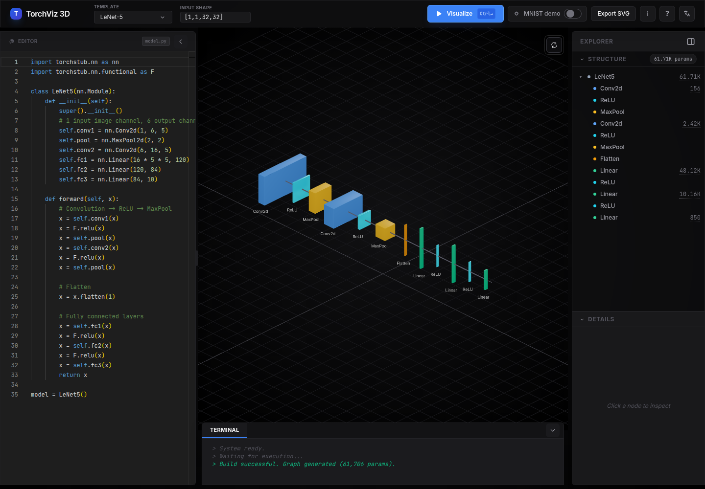
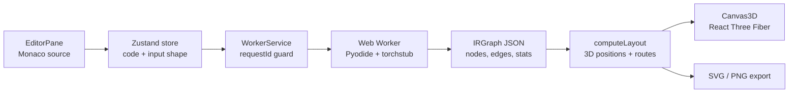

# TorchViz-3D

**TorchViz-3D turns PyTorch-style `nn.Module` code into interactive 3D neural
network architecture diagrams, entirely in the browser.**

[](https://react.dev/)
[](https://www.typescriptlang.org/)
[](https://vite.dev/)
[](https://pyodide.org/)
[](https://threejs.org/)

No backend. No model upload. No real PyTorch runtime. TorchViz-3D runs a
shape-only `torchstub` inside Pyodide, traces your model into an intermediate
graph, lays it out, and renders it as an explorable 3D scene.



## What It Does

- **Visualize PyTorch-like models** from `nn.Module` source code in a Monaco editor.
- **Render architecture as 3D blocks** with channels, spatial sizes, nested modules, and skip/concat edges.
- **Trace safely in-browser** using Pyodide and a fake shape-only `torch.nn`; your code stays local.
- **Inspect model structure** through a layer tree, parameter counts, hover/select sync, and terminal output.
- **Catch shape problems inline** by highlighting the failed layer instead of only throwing a traceback.
- **Start from built-in templates** including LeNet-5, Mini-ResNet, Mini-ViT, AlexNet, VGG-16, MobileNetV2, and UNet.
- **Export diagrams** as publication-friendly SVG or screen PNG.
- **Explore compatible demos** with MNIST/data-flow overlays and focused learning exercises.

## How It Works



The core trick is `torchstub`: a small fake `torch.nn` package that computes
output shapes and parameter counts without tensor math. It is enough information
to draw the architecture, while staying light enough to run in a browser.

## Try It Locally

### Requirements

- Node.js 20 or newer.
- A desktop browser; the workspace is designed for screens at least 1024px wide.
- Internet access is optional for the app runtime; external lesson references
  still require a connection when opened.

### Run

```bash
git clone https://github.com/duongtruongbinh/TorchViz-3D.git
cd TorchViz-3D
npm install
npm run dev
```

Open `http://localhost:3000`, pick a template or edit the model, then click
**Visualize** or press `Ctrl/Cmd+Enter`.

## Development

```bash
npm test         # node --test on src/lib/*.test.ts
npm run build    # production build in dist/
npm run verify   # typecheck + tests + build
```

The main runtime pipeline is:

```text
EditorPane -> zustand store -> WorkerService -> Pyodide worker + torchstub
  -> IRGraph -> computeLayout -> Canvas3D
```

## Documentation

- [Architecture](docs/ARCHITECTURE.md) - full data flow, IR contract, layout engine, and rendering notes.
- [Extending torchstub](docs/TORCHSTUB.md) - add support for more PyTorch layers.
- [Knowledge bundle](wiki/index.md) - structured subsystem docs, guides, and gotchas.
- [Workflow](docs/WORKFLOW.md) - required contribution workflow and plan format.
- [Learning Lab](wiki/concepts/learning-lab.md) - active typed-TOC, locale-MDX, routing, Review, and exercise architecture.
- [Learning Lab migration record](docs/plans/2026-07-14-approved-llm-lessons-mdx-migration.md) - current content-pipeline decisions and execution history.
