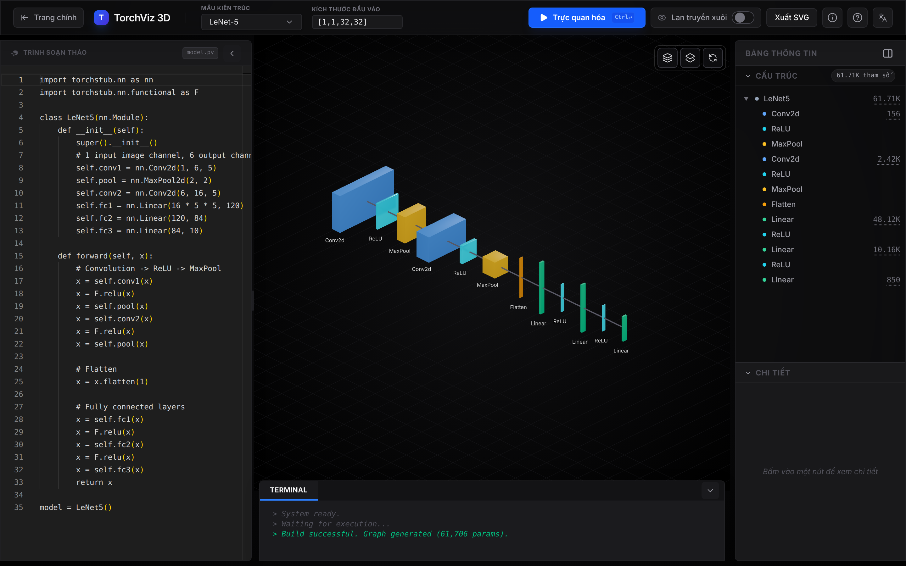
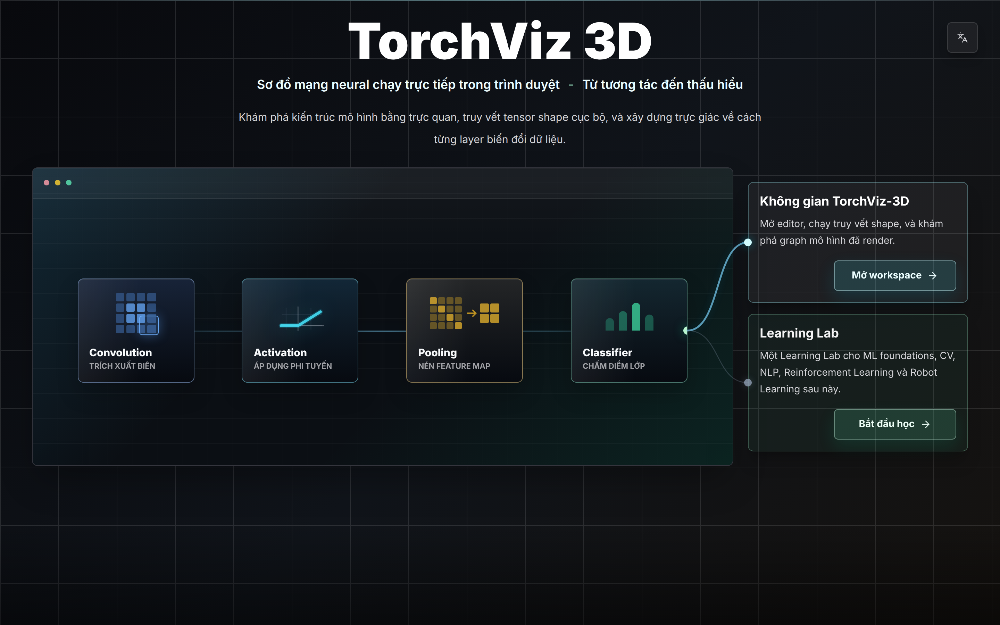
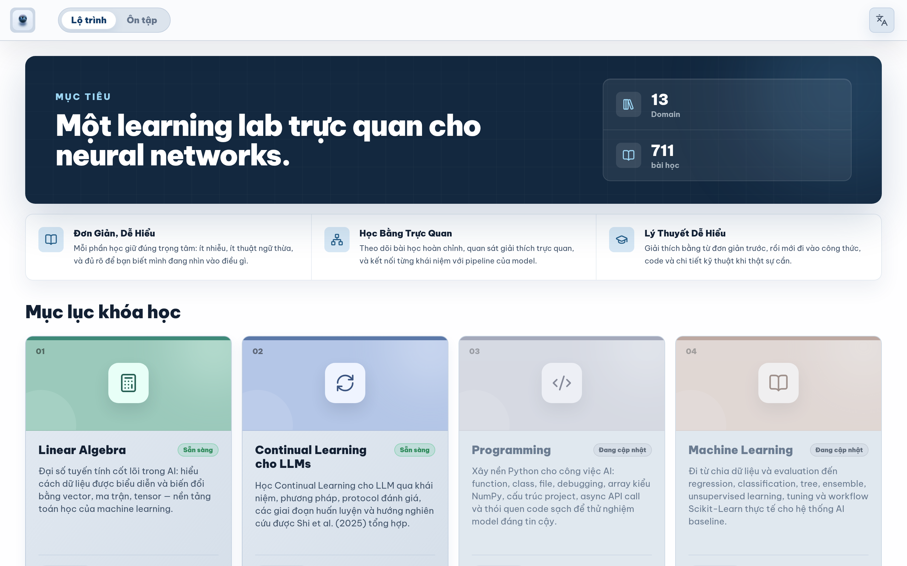
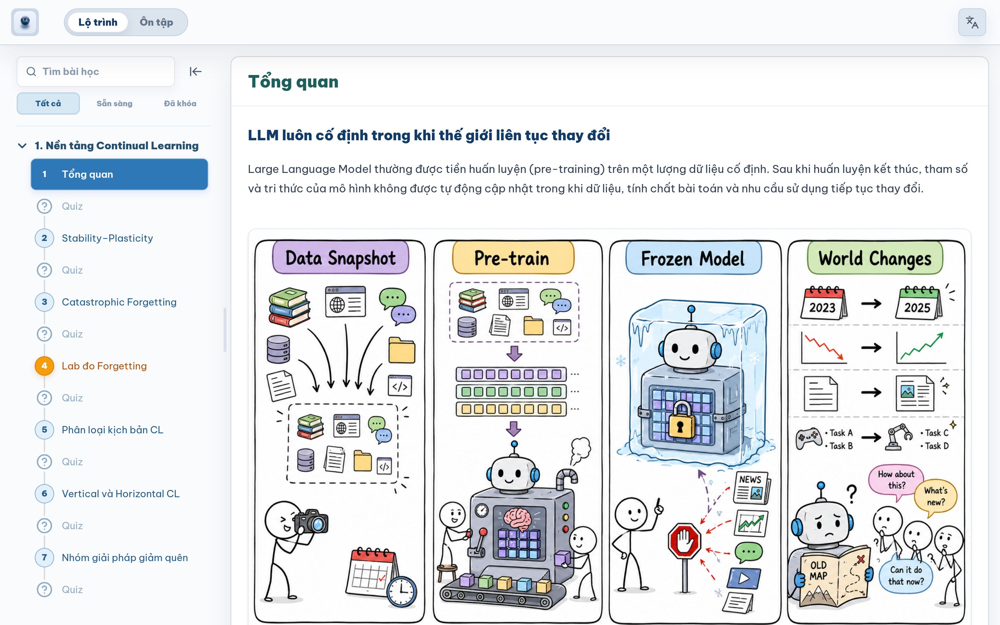
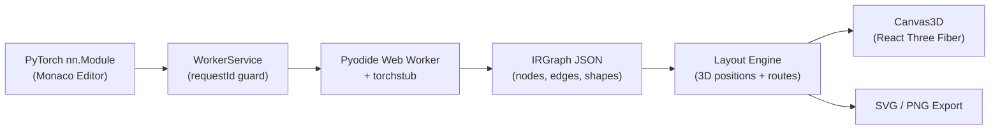

# TorchViz-3D

**An interactive browser-based environment for exploring neural network architectures in 3D and learning the mathematics and AI concepts behind them.**

[](https://react.dev/)
[](https://www.typescriptlang.org/)
[](https://vite.dev/)
[](https://tailwindcss.com/)
[](https://threejs.org/)
[](https://pyodide.org/)

No backend. No model upload. No heavy server runtime. TorchViz-3D interprets PyTorch-style `nn.Module` code in-browser using Pyodide and a shape-oriented `torchstub`, traces the network into an intermediate graph, and renders it as an interactive 3D scene alongside a rich, interactive Learning Lab.

<p align="center">
  
</p>


## Overview

TorchViz-3D brings together two integrated capabilities accessible from the unified landing hub:

1. **TorchViz Workspace** — A browser-native 3D modeling and inspection environment for PyTorch neural network architectures.
2. **Learning Lab** — An interactive, domain-driven learning environment covering core mathematics, machine learning foundations, computer vision, and AI engineering.

<p align="center">
  
</p>


## Features

### TorchViz Workspace

- **Edit PyTorch-style models** directly in an integrated Monaco code editor.
- **Trace architectures in-browser** using Pyodide (WASM) and `torchstub` without running a Python backend or uploading code.
- **Visualize in interactive 3D** with Three.js and React Three Fiber, showing tensor spatial dimensions, channel depths, skip/residual connections, and hierarchical container grouping.
- **Inspect layer structures** with parameter breakdowns, node selection sync with editor code, and terminal build logs.
- **Inline shape validation** highlights mismatched layers directly on the canvas and in the terminal.
- **Built-in architecture templates** include LeNet-5, Mini-ResNet, Mini-ViT, AlexNet, VGG-16, MobileNetV2, and UNet.
- **Export diagrams** as publication-ready vector SVG or screen PNG.

### Learning Lab

- **Curriculum organized by AI domain**, materialized from typed, React-free Tables of Contents (TOC).
- **Rich authored MDX lessons** featuring live KaTeX mathematical formatting and interactive visualizations.
- **Interactive mathematical visualizers** (Cartesian vectors, matrix operations, systems of linear equations, eigenspaces, PCA, and SVD) powered by Mafs.
- **Capability-gated lazy loading**: Reference citation tools (`Cite`, `PaperSummary`) and domain adapters load on demand without bloating the initial bundle.
- **Structured assessments & search**: In-lesson quizzes, interactive shape exercises, and fast per-domain search.

<p align="center">
  
</p>

<p align="center">
  
</p>


## How It Works

### Workspace Architecture



The core technique is **`torchstub`** (`src/lib/python_sources.ts`), a lightweight Python module that intercepts PyTorch `torch.nn` layer calls to perform shape inference and parameter counting without tensor arithmetic. This produces a clean Intermediate Representation (`IRGraph`) that the layout engine turns into a 3D isometric scene.

### Learning Lab Pipeline

```text
Typed Domain TOCs
  → React-Free Catalog (materializeCatalog)
  → Route Resolution & Selectors
  → Locale-Authored MDX
  → Capability-Gated Domain & Reference Renderers
```

Content navigation is decoupled from UI rendering. Navigation metadata lives in typed TOCs, authored content lives in locale-specific MDX files, and domain-specific visual components are loaded dynamically only when requested.


## Quick Start

### Requirements

- **Node.js**: LTS version (Node 20+ recommended).
- **Browser**: Modern desktop browser supporting WebGL and WebAssembly (screen width &ge; 1024px recommended for the 3D workspace).

### Installation & Run

```bash
git clone https://github.com/duongtruongbinh/TorchViz-3D.git
cd TorchViz-3D
npm install
npm run dev
```

Open `http://localhost:3000` in your browser. From the landing page, choose **Workspace** to design 3D models or **Learning Lab** to explore the interactive curriculum.


## Development Commands

| Command | Purpose |
| :--- | :--- |
| `npm run dev` | Start Vite development server (`http://localhost:3000`) |
| `npm run typecheck` | Run TypeScript type checks (`tsc --noEmit`) |
| `npm test` | Run the Node test suite (`src/**/*.test.ts`) |
| `npm run build` | Build production bundle in `dist/` |
| `npm run verify` | Full verification pipeline (`typecheck` + `test` + `build`) |
| `npm run preview` | Preview production build locally |


## Tech Stack

- **Framework & Language**: React 19 · TypeScript 6 · Vite 8 · Tailwind CSS 4
- **3D & Graphics**: Three.js · React Three Fiber · Drei · Lucide Icons
- **In-Browser Execution**: Pyodide (Python on WebAssembly) · `torchstub` shape tracer
- **Editor & Content**: Monaco Editor · MDX · KaTeX · Mafs · Shiki · Floating UI
- **State Management**: Zustand · React Router


## Project Structure

```text
src/
├── components/
│   ├── landing/          # Landing entry surface and flow visualizer
│   ├── workspace/        # 3D workspace, Monaco editor pane, and inspector
│   ├── canvas/           # Three.js / React Three Fiber 3D scene
│   ├── exercises/        # Shape/conv/value exercise engines shared with Learning Lab
│   ├── mnist-demo/       # Forward-pass MNIST animation demo
│   ├── operation-effects/ # Operation visual effect primitives for the canvas
│   └── learning/         # Learning Lab shell, MDX registry, and domain adapters
├── content/learning/     # Typed domain TOCs and locale-authored MDX lessons
├── core/learning/        # React-free catalog contracts, materialization, and selectors
├── lib/                  # Layout engine, IR types, torchstub Python source, SVG export, and route helpers
├── store/                # Zustand stores for workspace state and preferences
├── templates/            # Built-in PyTorch architecture templates
└── workers/              # Pyodide Web Worker host

docs/                     # Architecture specifications, torchstub guide, and workflow plans
wiki/                     # OKF knowledge bundle (concepts, subsystem guides, gotchas)
scripts/                  # MDX validators, search generators, and build projections
```


## Documentation

- [Architecture Guide](docs/ARCHITECTURE.md) — Detailed data flow, IR contract, layout algorithms, and renderer notes.
- [Extending torchstub](docs/TORCHSTUB.md) — How to add shape inference for new PyTorch operations.
- [Learning Lab Architecture](wiki/concepts/learning-lab.md) — UI ownership layers, component reuse rules, and MDX authoring contract.
- [Knowledge Bundle](wiki/index.md) — Subsystem documentation, guides, and gotchas.
- [Workflow Guide](docs/WORKFLOW.md) — Mandatory task workflow and stored plan rules.
- [Contributing](CONTRIBUTING.md) — Development setup and contribution guidelines.


## Scope & Notes

- **Shape-Oriented Tracing:** TorchViz-3D computes layer output dimensions and parameter counts for architectural visualization; it does not execute full tensor mathematical backends.
- **Workspace Layout:** The 3D modeling workspace is designed for desktop viewports (&ge; 1024px).
- **Curriculum Coverage:** Learning Lab organizes curriculum across multiple AI domains; authored lesson depth varies by domain with explicit placeholder indicators for unpublished topics.
